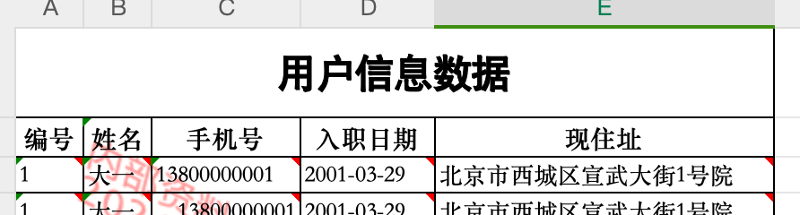
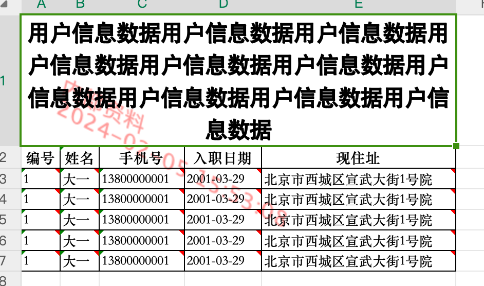
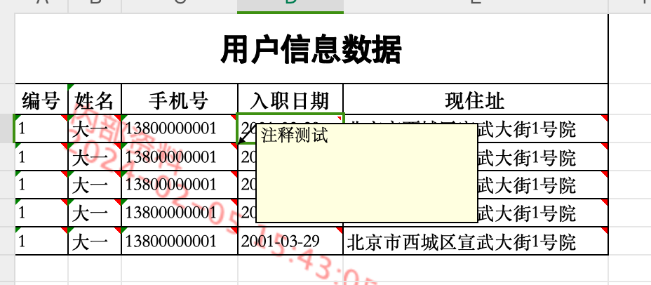
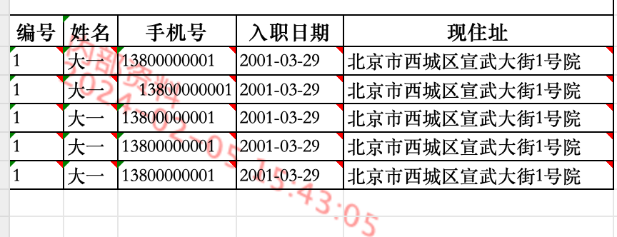
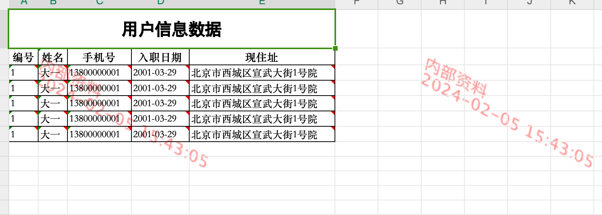
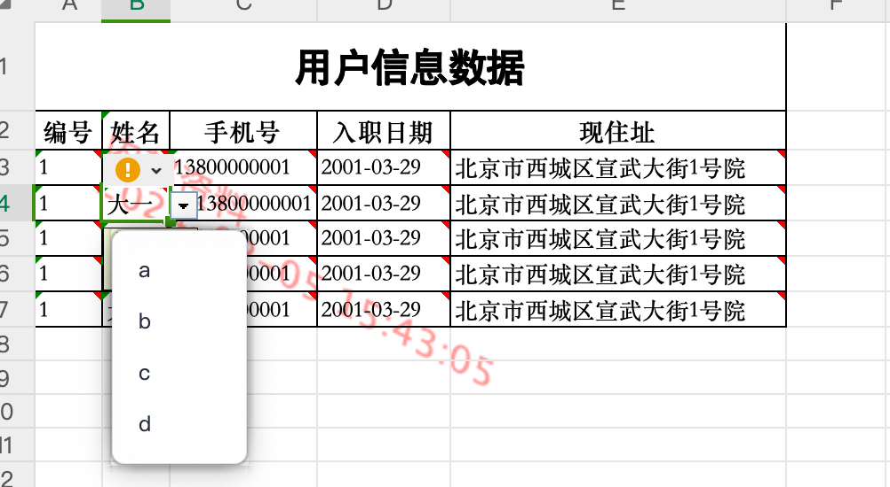
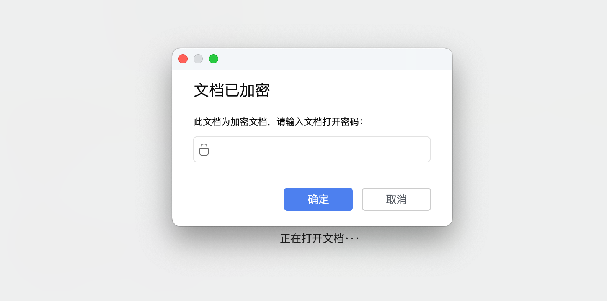
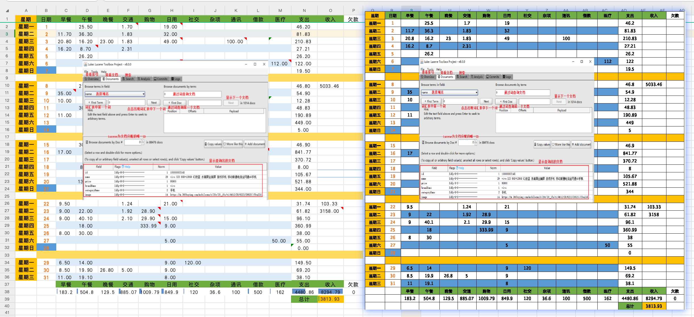

# POI--工具类封装3-17使用文档

| 功能                   | xls  | xlsx |
| ---------------------- | ---- | ---- |
| 合并单元格             | ✅    | ✅    |
| 合并单元格的自适应行高 | ✅    | ✅    |
| 自适应列宽             | ✅    | ✅    |
| 锁定单元格             |      |      |
| 单元格注释             | ✅    | ✅    |
| 设置下拉               | ✅    | ✅    |
| sheet水印              | ❌    | ✅    |
| 文档加密               | ❌    | ✅    |
| 图片导出               | ✅    | ✅    |

## 合并单元格



```java
//合并单元格
ExcelExportUtil_3_17.addMergedRegion(workbook, sheet, 0, 0, 0, 4);
```

## 合并单元格自适应高度



```java
//合并单元格
ExcelExportUtil_3_17.addMergedRegion(workbook, sheet, 0, 0, 0, 4);
//设置数据
CellStyle titleStyle = ExcelExportUtil_3_17.setTitleStyle(workbook);
ExcelExportUtil_3_17.setCellValue(titleStyle, cell00, "用户信息数据");
//自适应高度
ExcelExportUtil_3_17.calcAndSetRowHeight(cell00, 40);
//bigTitleRow.setHeightInPoints(42);//固定高度
```

## 锁定单元格


## 单元格注释



```java
//绘制单元格数据
String[] users = new String[]{"1", "大一", "13800000001", "2001-03-29", "北京市西城区宣武大街1号院"};
for (int rowNum = 0; rowNum < 5; rowNum++) {
    Row row = sheet.createRow(2 + rowNum);
    for (int colNum = 0; colNum < titles.length; colNum++) {
        Cell cell = row.createCell(colNum);
        ExcelExportUtil_3_17.setCellValue(workbook, cell, users[colNum]);
        //单元格注释
        ExcelExportUtil_3_17.setCellPatriarch(cell, "注释测试");
    }
}
```

## 自适应宽度



```java
//存储最大列宽
Map<Integer, Integer> maxWidth = new HashMap<>();

//绘制单元格数据
String[] users = new String[]{"1", "大一", "13800000001", "2001-03-29", "北京市西城区宣武大街1号院"};
for (int rowNum = 0; rowNum < 5; rowNum++) {
    Row row = sheet.createRow(2 + rowNum);
    for (int colNum = 0; colNum < titles.length; colNum++) {
        Cell cell = row.createCell(colNum);
        ExcelExportUtil_3_17.setCellValue(workbook, cell, users[colNum]);

        int length = (int) (ExcelExportUtil_3_17.calcCellWidth(cell));
        length = Math.min(length, 15000);
        maxWidth.put(colNum, Math.max(length, maxWidth.get(colNum)));
    }
}

//设置统计好的自适应列宽
for (int i = 0; i < titles.length; i++) {
    sheet.setColumnWidth(i, maxWidth.get(i));
}
```

## 设置水印



```java
//设置水印
ExcelExportUtil_3_17.setWatermarkImage(sheet);

//去除水印
ExcelExportUtil_3_17.removeWatermarkImage(sheet);
```


## 设置下拉框



```java
//设置下拉框
ExcelExportUtil_3_17.dynamicOptions(
    new ExcelExportUtil_3_17.DynamicOptionInfo()
    .setSheet(sheet)
    .setOptions(new String[]{"a", "b", "c", "d"})
    .setPromptBoxShow(true)
    .setPromptBoxMessage("请选择")
    .setFirstCol(1)
    .setLastCol(1)
);

```

## 设置密码



```java
//设置密码
ExcelExportUtil_3_17.setPassword(workbook, fos, "1234");
fos.close();

//取消密码
FileInputStream fis2 = new FileInputStream(new File("./testStyle-pwd.xlsx"));
FileOutputStream fos2 = new FileOutputStream("./testStyle-pwd-3.xlsx");
ExcelExportUtil_3_17.removePassword(fis2,fos2,"1234");
```

## Excel转图片

```java
ExcelExportUtil_3_17.excel2image("./file.xlsx","./");
```



